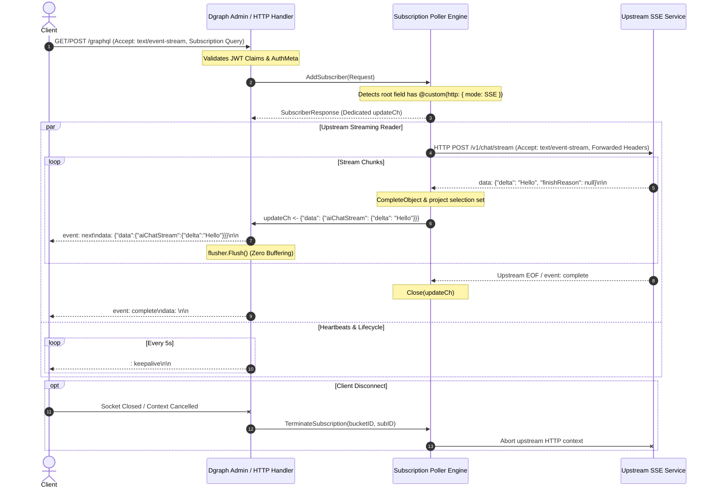

# Custom HTTP Subscriptions: Upstream Server-Sent Events (SSE) Pass-Through

This document specifies the technical design, schema semantics, and runtime architecture for
supporting **upstream Server-Sent Events (SSE) pass-through** for GraphQL subscriptions in Dgraph
via `@custom(http: { mode: SSE, ... })`.

---

## 1. Overview & Motivation

Dgraph functions as the primary database engine and unified GraphQL entry point for applications. In
many modern architectures (such as AI chat streaming, real-time activity feeds, and external
notification services), microservices emit continuous event streams using HTTP Server-Sent Events
(`text/event-stream`).

Previously, Dgraph's `@custom(http: ...)` directive only supported unary request-response execution
(`SINGLE` and `BATCH` modes), while subscriptions were restricted to internal graph mutations and
custom DQL queries.

With **Custom HTTP SSE Subscriptions**, Dgraph acts as a transparent, high-performance streaming
gateway:

1. **Unified Entry Point**: Clients connect exclusively to Dgraph's GraphQL subscription endpoint
   (`/graphql` with `Accept: text/event-stream` or WebSocket).
2. **GraphQL-Level Security**: Dgraph performs pre-flight JWT verification, authentication checks,
   and header forwarding before opening upstream connections.
3. **Zero-Buffering Streaming**: Upstream SSE event chunks are streamed and immediately flushed
   (`flusher.Flush()`) down to the client socket with zero intermediate disk or memory buffering.
4. **Bi-Directional Lifecycle Management**: Client disconnections instantly abort the upstream
   backend HTTP connection, preventing dangling processes.

---

## 2. Schema Specification

### 2.1 Extending `enum Mode`

The `Mode` input enum in `graphql/schema/gqlschema.go` is extended with `SSE`:

```graphql
enum Mode {
  BATCH
  SINGLE
  SSE
}
```

### 2.2 Schema Definition Example

Developers configure a custom query with `@withSubscription` and `mode: SSE` inside `type Query`:

```graphql
type AIStreamChunk @remote {
  delta: String
  finishReason: String
  tokens: Int
}

type Query {
  aiChatStream(prompt: String!, model: String): AIStreamChunk
    @withSubscription
    @custom(
      http: {
        url: "https://llm-gateway.internal/v1/chat/stream"
        method: "POST"
        body: "{ prompt: \"$prompt\", model: \"$model\" }"
        mode: SSE
        forwardHeaders: ["Authorization", "X-Workspace-Id"]
        secretHeaders: ["X-Api-Key:LLM_API_KEY"]
      }
    )
}
```

Dgraph automatically generates the corresponding field under `type Subscription`:

```graphql
type Subscription {
    aiChatStream(prompt: String!, model: String): AIStreamChunk
        @withSubscription
        @custom(http: { ... })
}
```

### 2.3 Client Subscription Query

Clients initiate a standard GraphQL subscription over SSE (`graphql-sse` protocol) or WebSocket:

```graphql
subscription {
  aiChatStream(prompt: "Summarize this resume", model: "gemini-1.5-pro") {
    delta
    finishReason
  }
}
```

---

## 3. Architecture & Execution Pipeline



---

## 4. Key Implementation Components

### 4.1 Schema Validation (`graphql/schema/rules.go`)

The validator rule `fieldDirectiveCheck()` is updated to permit `@withSubscription` on
`@custom(http: ...)` queries when `mode == "SSE"`:

- If `customDir != nil && subsDir != nil`:
  - Allow if `customDir.Arguments.ForName("dql") != nil`, OR
  - Allow if `customDir.Arguments.ForName("http")` contains `mode: SSE`.
  - Otherwise, reject with error:
    `"custom query should have dql argument or http with mode SSE if @withSubscription directive is set"`.

### 4.2 Subscription Engine (`graphql/subscription/poller.go`)

Inside `AddSubscriber(req *schema.Request)`:

1. **Detection**: Check if root field in `op.Queries()` is a custom HTTP field with `mode: SSE`.
2. **Dedicated Stream**: Unlike standard Dgraph subscriptions that coalesce identical queries into
   shared polling buckets, each SSE pass-through subscription runs as an independent 1:1 stream with
   its own unique `subscriptionID` and cancellable `context.Context`.
3. **Upstream Streaming Worker**:
   - Uses an HTTP client with `Transport.DisableCompression = true` and `Timeout = 0` (persistent
     streaming).
   - Reads incoming lines using `bufio.Reader`.
   - For each `data: <JSON>` line:
     - Unmarshals the payload.
     - Maps through `schema.CompleteObject()` against the subscription selection set.
     - Enqueues into `subResp.UpdateCh`.
   - Closes `UpdateCh` on upstream EOF or completion.

### 4.3 Downstream Delivery (`graphql/admin/http.go`)

Dgraph's existing streaming HTTP loop:

- Reads from `subResp.UpdateCh`.
- Emits `event: next\ndata: <JSON>\n\n`.
- Calls `flusher.Flush()` immediately.
- When `r.Context().Done()` fires, `TerminateSubscription()` cancels the upstream context.

---

## 5. Security & Authentication

1. **Pre-flight Authentication**: Subscriptions must provide a valid JWT if `@auth` or security
   rules are defined. If invalid or expired, the subscription is rejected at the HTTP layer before
   contacting the upstream backend.
2. **Header Forwarding**: Configured `forwardHeaders` (e.g. `Authorization`, tenant IDs) and
   `secretHeaders` (e.g. API keys from Dgraph secrets store) are injected into the upstream request.
3. **Safe Termination**: Premature client termination immediately cancels the upstream HTTP request
   context, closing the connection and preventing backend resource leaks.
