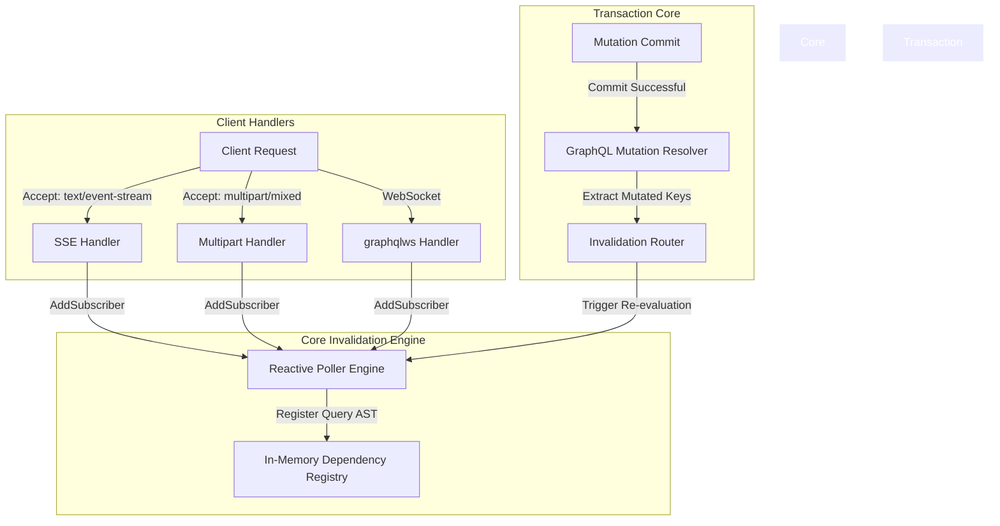
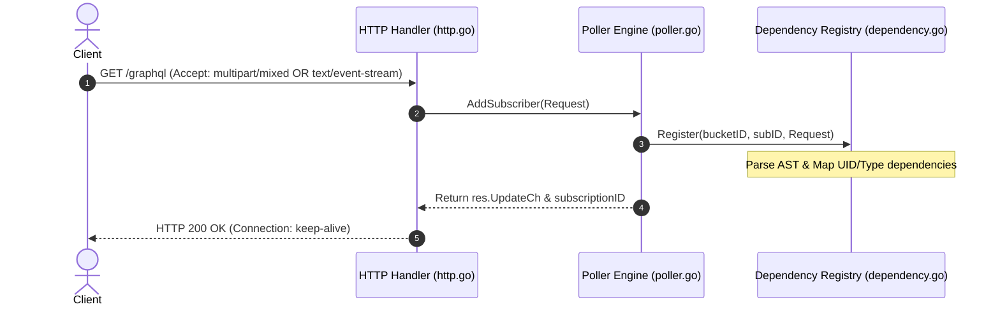
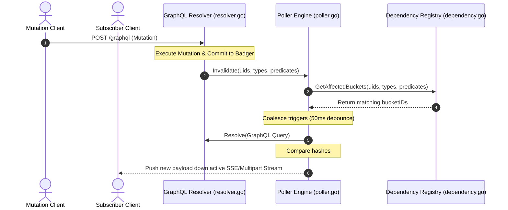
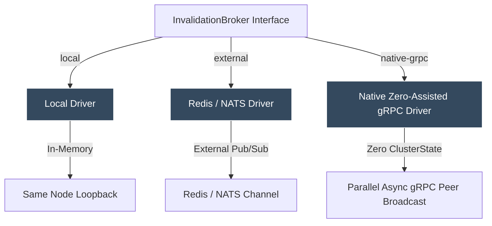
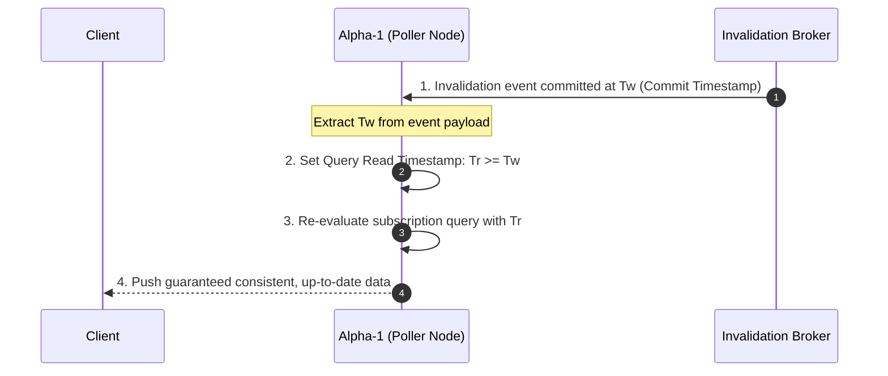

# GraphQL Subscription Redesign: Reactive Invalidation & Dual HTTP Streaming (SSE & Multipart/Mixed)

This document specifies the technical architecture, design components, and data flows to migrate
Dgraph's GraphQL subscription engine from a proactive, resource-intensive polling model to a
reactive, event-driven invalidation model with native HTTP-based streaming support.

---

## 1. Problem Statement & Objectives

### The Current Polling Mechanism

Currently, Dgraph's GraphQL subscriptions use a **polling-based design** at the server layer.

1. When a client subscribes, the Alpha node hashes the query representation and grouping variables
   into a `bucketID`.
2. A single background goroutine sleep-polls the core transactional engine for that `bucketID` every
   `poll-interval` (default `1s`).
3. If the query result hash changes, the update is pushed to all active subscribers via WebSockets.

### Core Scaling Bottlenecks

- **Query Read Amplification**: If there are $N$ unique subscriptions (e.g., users subscribing to
  their individual user profiles), Alpha must run $N$ database queries every second, even if the
  database is 100% idle. This triggers high CPU, disk, and memory churn.
- **Latency Limits**: The real-time delay is bound by the `poll-interval`. Reducing the interval to
  improve latency increases query load exponentially.
- **WebSockets Overhead**: WebSockets are stateful, require specialized client libraries, and
  struggle to traverse corporate firewalls, API Gateways, and serverless network infrastructure.

### Design Objectives

- **True Event-Driven Processing**: Transition subscription evaluations to run strictly on-demand
  (only when a transaction modifies data the query depends on).
- **Native HTTP Streaming (Dual Formats)**:
  - **Server-Sent Events (SSE)**: For standard browser `EventSource` consumption.
  - **Multipart HTTP (`multipart/mixed`)**: For seamless, zero-dependency streaming with Apollo
    Client's standard `HttpLink`.
- **Complete Backward Compatibility**: Retain standard WebSocket connection flows and existing
  client compatibility with zero client-side changes.

---

## 2. Technical Architecture

The redesigned subscription engine contains four primary logical layers:



### Component A: Query Dependency Registry

When a subscriber registers, Dgraph parses the GraphQL AST to analyze its dependencies.

1. **Instance-level dependency (UIDs)**: Tracks specific node IDs (e.g., `getUser(id: "0x12a")`
   registers `UID: 0x12a` + requested predicates).
2. **Type-level dependency (Collections)**: Tracks broad entity type additions/removals (e.g., list
   queries on type `Todo` register `Type: Todo` + filters).
3. **Inverted Index**: These dependencies are stored in an optimized, thread-safe, in-memory
   Concurrent Trie:
   - **Keys**: `(UID, Predicate)` or `(Type, Predicate)`
   - **Values**: `Set of (SubscriptionID, BucketID)`

### Component B: Mutation-Based Invalidation Hook

Upon any successful mutation resolved by `resolver.Resolve()`:

1. Dgraph extracts the mutated keys (the updated UIDs, Predicates, and Object Types) directly from
   the successfully committed transaction results.
2. It publishes this change summary:
   ```go
   poller.Invalidate(mutatedUIDs, mutatedTypes, mutatedPredicates)
   ```

### Component C: Reactive Poller Engine

The continuous `time.Sleep` loop in the poller goroutine is replaced with a **select-based trigger
stream**:

1. When `Invalidate()` is called, Dgraph checks the **Dependency Registry** to find any affected
   `bucketIDs`.
2. For each affected bucket, Dgraph writes a non-blocking signal to a bucket-specific `triggerCh`
   channel.
3. Upon receiving a trigger signal, the polling routine wakes up, re-executes the GraphQL query,
   hashes the bytes, and pushes any changed JSON payloads to all registered subscriber channels
   (`res.UpdateCh`).
4. **Coalescence Window**: Includes a 50ms debouncer to merge rapid consecutive mutations into a
   single database read.

### Component D: Dual HTTP Streaming Handler

Allows standard HTTP clients to subscribe natively via content negotiation:

- **SSE (`text/event-stream`)**: Format payloads using standard SSE data framing:
  ```http
  data: {"data": {...}}\n\n
  ```
- **Multipart HTTP (`multipart/mixed`)**: Format payloads using standard MIME multipart boundaries:
  ```http
  ---\r\n
  Content-Type: application/json\r\n\r\n
  {"data": {...}}\r\n
  ```

---

## 3. Core Protocols & Data Flows

### A. Subscription Registration Flow



### B. Reactive Invalidation & Streaming Flow



### C. Token Expiration Flow

Since the reactive engine does not run on a periodic timer, token expiration is handled via a
**Reactive Expiry Timer** to prevent connection/security leaks when the database is idle:

```mermaid
sequenceDiagram
    autonumber
    actor Client
    participant Poller as Poller Engine
    participant Timer as Runtime Timer (time.AfterFunc)

    Client->>Poller: Start Subscription (with Auth Token)
    Note over Poller: Extract Token Expiry duration (e.g. 15 mins)
    Poller->>Timer: Schedule TerminateSubscription in 15 mins
    ... 15 mins pass ...
    Timer->>Poller: Fire Expiry Event
    Poller->>Client: Close stream / Terminate Connection
```

---

## 4. Connection & Transport Multiplexing

### Connection Reuse (Network-Level)

Using standard HTTP streaming formats allows standard **HTTP/2 and HTTP/3** layers to manage socket
reuse automatically.

- When multiple subscriptions are created, the browser/client multiplexes all SSE/Multipart requests
  over **a single TCP/QUIC socket**.
- This eliminates the traditional HTTP/1.1 bottleneck (which limits browsers to 6 concurrent
  long-lived connections per domain).

### Client Integration Support

1. **Apollo Client**: Supports the `multipart/mixed` transport natively through its standard
   `HttpLink` without any external socket or transport libraries:
   ```javascript
   const link = new HttpLink({
     uri: "https://api.dgraph.io/graphql",
     multipart: true,
   })
   ```
2. **Standard Browsers**: Can consume subscriptions using native, built-in standard browser APIs:
   ```javascript
   const eventSource = new EventSource("/graphql?query=subscription { ... }")
   ```

---

## 5. Security & Isolation

- **Namespace Isolation**: Subscriptions and dependency registries are isolated by `Namespace` at
  the GraphQL layer. Mutated UIDs from Namespace A will never trigger or invalidate subscription
  registries on Namespace B.
- **Token Expiration Safeguard**: `time.AfterFunc` timers run inside a lightweight Go scheduler with
  microsecond precision, ensuring connections are closed immediately upon token expiry even on
  completely idle database clusters.

---

## 6. Pluggable Clustered Invalidation System & Node Support

To support multi-node scale out, the Dgraph `Poller` delegates invalidation broadcasts to a
pluggable `InvalidationBroker` interface. This allows developers to choose their preferred level of
infrastructure dependency.

### The Invalidation Broker Interface

```go
type InvalidationMessage struct {
	UIDs       []string `json:"uids,omitempty"`
	Types      []string `json:"types,omitempty"`
	Predicates []string `json:"predicates,omitempty"`
	Namespace  uint64   `json:"namespace"`
}

type InvalidationBroker interface {
	// Publish broadcasts an invalidation event cluster-wide.
	Publish(ctx context.Context, msg *InvalidationMessage) error

	// Subscribe starts listening for cluster-wide invalidations and triggers local poller evaluations.
	Subscribe(ctx context.Context, handler func(msg *InvalidationMessage)) error

	// Close safely terminates any open broker connections.
	Close() error
}
```

### Supported Cluster Drivers



#### Driver 1: Local Loopback (`local`)

- **Usage**: Default out-of-the-box configuration.
- **Mechanics**: Immediately loops back published invalidation messages to the local `Poller`
  instance on the same node. Excellent for lightweight developer environments and single-instance
  deployments.

#### Driver 2: External Pub/Sub (`redis` or `nats`)

- **Usage**: Configured via a superflag:
  `--graphql "subscription-invalidation-broker=redis://10.0.0.5:6379;"`
- **Mechanics**:
  - `Publish()` JSON-serializes the `InvalidationMessage` and publishes it to a shared broker
    channel (e.g. `dgraph-graphql-invalidations`).
  - `Subscribe()` runs a background listener that polls the message channel, deserializes incoming
    messages, and executes local `Poller` trigger evaluations.
- **Resiliency**: Extremely resilient and highly performant. The broker serves as a dedicated event
  queue, offloading cross-node broadcast overhead from your database instances.

#### Driver 3: Native Zero-Assisted gRPC (`native-cluster`)

- **Usage**: Configured via `--graphql "subscription-invalidation-broker=native-cluster;"`. This
  offers high-performance clustered support with **zero external software dependencies**.
- **Mechanics**:
  1. Dgraph Alphas continuously heartbeat with Dgraph Zeros, maintaining a local, real-time registry
     of all active Alpha nodes in the cluster (`groups().State()`).
  2. When a mutation is successfully committed, the originating Alpha identifies all other active
     Alpha nodes.
  3. It fires parallel, asynchronous gRPC `InvalidateRequest` calls directly to the internal gRPC
     ports of each active peer Alpha.
  4. Each peer Alpha receives the gRPC payload, extracts the mutation metadata, and pushes it
     directly into its local `Poller` trigger stream.
- **Resiliency**: If a peer is temporarily network-partitioned or slow, the P2P gRPC sender
  implements non-blocking asynchronous dispatch with a 500ms timeout and basic exponential retries,
  ensuring transient network errors never block the database transaction thread.

---

## 7. Advanced Subscription State & Consistency Mechanics

To guarantee absolute data consistency, prevent stale reads, and support fine-grained nested object
invalidations, Dgraph implements three core synchronization guardrails:

### A. Fine-Grained Nested Object Tracking (Resolved Entity Tracking)

When a subscription reads nested node relationships (e.g., `user -> address`), modifications made
strictly to the child node (updating `city` on `address 0x999`) must trigger the parent
subscription.

Dgraph solves this using **Resolved Entity Tracking**:

1. **Initial Evaluation**: When a subscription is first registered, Dgraph executes the GraphQL
   query once to fetch the initial state.
2. **Response Parsing**: The `Poller` reads the JSON response payload, recursively extracts all UIDs
   returned (both the root `User 0x1` and the nested `Address 0x999`), and registers them in the
   `DependencyRegistry` under that client's `SubscriptionID`.
3. **Trigger Matching**:
   - If a mutation updates Address `0x999`, the invalidation message contains
     `mutatedUIDs: ["0x999"]`.
   - The `DependencyRegistry` matches `0x999` directly to the client's `SubscriptionID` in $O(1)$
     time, and triggers re-evaluation.
4. **Self-Healing Graph**: If the relationship changes (the user gets a new address `0x888`), the
   re-evaluation query returns `0x888`. The `Poller` automatically deregisters `0x999` and registers
   `0x888` in the `DependencyRegistry`.

### B. Transaction Read Isolation (Stale Read Prevention)

In a clustered environment, a tiny replication lag can cause a re-evaluating Alpha node to read
stale data, causing the subscription stream to skip a real-time event.



- **The Mechanism**: The `InvalidationMessage` payload includes the **Commit Timestamp ($T_w$)** of
  the successful mutation transaction.
- **Consistent Queries**: When the `Poller` wakes up to re-evaluate a query, it explicitly passes
  $T_w$ as the GraphQL **Read Timestamp ($T_r$)** (where $T_r \ge T_w$). This forces Dgraph to wait
  for local replicas to apply up to that timestamp before executing, guaranteeing that the
  subscription never emits a stale read or skips a mutation.

### C. Flood Protection (Batch Mutation Backpressure)

If a bulk import or automated service commits thousands of rapid-fire mutations, triggering a
re-evaluation for every single write would overload the Alpha database engine.

Dgraph implements a two-stage backpressure system:

1. **Coalescence Window (Debouncing)**: Invalidation trigger signals are buffered in a 50ms sliding
   window per subscription bucket. 100 rapid mutations committed in a 50ms window are coalesced into
   a single database query.
2. **Rate Capping**: Subscriptions are capped at a maximum of 5 re-evaluations per second. If this
   cap is exceeded, the subscription enters a "throttled" state, combining further events and
   executing a single final consistent read once the mutation spike subsides.
